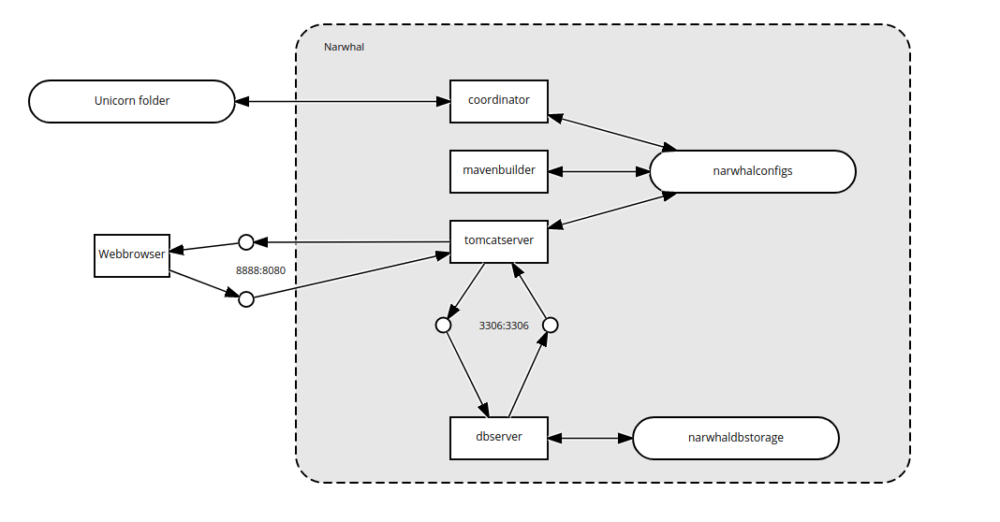
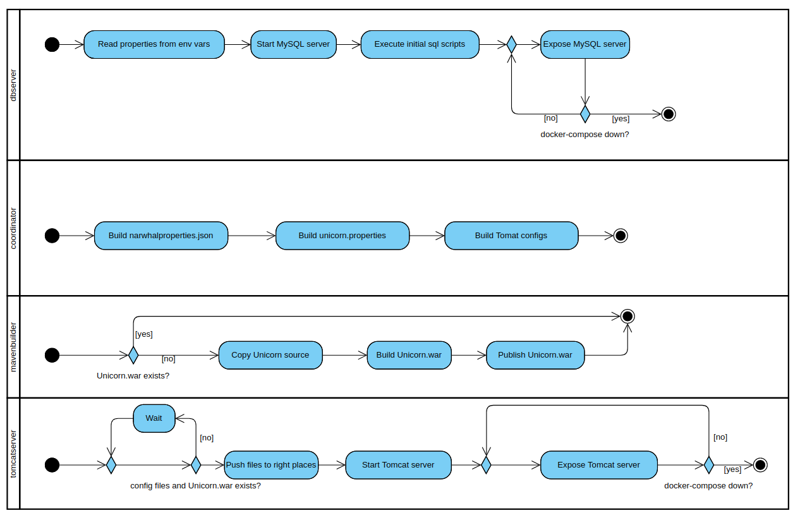

# Narwhal: An Unicorn integration based on Docker
## Prepare Narwhal
1. Install Docker and Docker-compose as it is described in official [Docker Docs](https://docs.docker.com/).
2. Clone the Unicorn repository from GitHub to your local machine:
    ```sh
    git clone https://github.com/bptlab/Unicorn.git
    ```
3. Go to _Path_To_UnicornFolder/narwhal_ and copy the file _envtemplate.txt_.
4. Adapt the copy of the file _envtemplate.txt_ as follow: 
    1. Replace "yourdbpasswd" by a password which will set as password for the root user of the MySQL-Database
    2. Replace "tomcatadmin" by an username which will be used to administrate the Tomcat server.
    3. Replace "yourtomcatadmin" by a password which will be set for the user created in step 4.2.
    4. Last but not least, replace "pathToYourRepository" by the path where the cloned repository exists on your hard drive.
    * NOTE: Step one to three are optional. If you do not replace the standard configuration, Narwhal will generate new ones because of security issues. 
5. Rename the edited copy of the file _envtemplate.txt_ to _.env_. Yes, you are rigth, it's only the file type suffix without any file name!

## Use Narwhal
You have to follow the section _Prepare Narwhal_ to start and use Narwhal!
### Start Narwhal
1. Go to the directory _Path_To_UnicornFolder/narwhal_.
2. Run the following command there:
    ```sh
    docker-compose up
    ```
* Now the Docker-Compose Deamon builds everything. If you start it the first time, the process will take some time. The output _"narwhal-tomcatsrv | INFO: Server startup in x ms"_ informes about the process finished. 

### Use Unicorn
If you use the Docker based integration (Narwhal) or if you directly installed Unicorn, there isn't any different in usage. \
Open your browser and go to http://localhost:8888/Unicorn/ to access to the Unicorn user interface.

### Stop Narwhal
1. Go to the directory _Path_To_UnicornFolder/narwhal_.
2. Run the following command there:
    ```sh
    docker-compose down
    ```

### Reset Narwhal
However you want to reset Narwhal. There are two persistence layers, the database for all data depends on the event processing and the Narwhal system layer. Both data exists on seperated virtual Docker volumes. In addition you can rebuild the Narwhal integration. \
* To reset the database layer run: 
    ```sh
     docker volume rm narwhal_narwhaldbstorage 
    ```
* To reset the system layer run:
    ```sh
    docker volume rm narwhal_narwhalconfigs
    ```
* To rebuild the environment start Narwhal with
    ```sh
    docker-compose up --build
    ```
    instead of use only
    ```sh
    docker-compose up
    ```

## Implementation details
### Architecture concept



The Narwhal environment is made up of three different services, the database server, the tomcat server, the Maven builder and the coordinator service. Each one runs in its own container. To communicate and exchange data through containers, we use virtual network links and volumes.

### Organisation concept



All services start simultaneously. On the one hand, the database service configures itself independend from the other services. On the one hand, the Tomcat server and the Maven builder require configurations created by the coordinator service. The coordinator service creates configs based on the environment settings in the .env file. If every configuration file is created, the coordinator services ends. In case of missing or insufficient credentials, the coordinator generates random ones because of security issues. \
If its result does not already exists, the Maven builder holds out for the unicorn.properties. If everything is checked, it copies the original source code from the host filesystem and builds the Unicorn.war. 
Exists every required configuration file and the Unicorn.war, the Tomcat server service begins to start the Tomcat server.